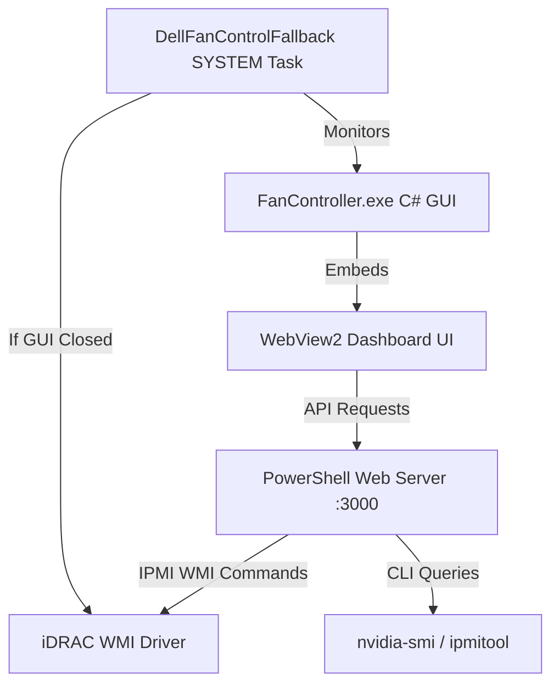

# Dell PowerEdge Fan Controller Dashboard

A modern, high-performance, and feature-rich fan control dashboard and daemon for Dell PowerEdge 13th generation servers (e.g., R730, R730xd, R630, T630) and OEM appliances (such as Avigilon HD NVRs) running newer iDRAC8 firmware.

This utility consists of a compiled **C# Windows Forms GUI** wrapping a premium **HTML/CSS/JS Cyberpunk-styled WebView2 Dashboard**, powered by a local non-blocking **PowerShell Web Server** (`server.ps1`) executing local WMI-based IPMI commands. It also includes an automated system startup fallback script to guarantee server safety when the GUI is closed.

---

## ⚡ Key Features

* **Three Control Modes**:
  * **Auto (iDRAC)**: Restores native iDRAC automatic fan regulation.
  * **Smart Curve**: Evaluates custom-defined multi-point temperature-to-speed interpolation tables based on the highest temperature of your CPU sockets and NVIDIA GPU.
  * **Manual**: Instantly locks fan speed between 10% and 100% using presets or precision sliders.
* **Modern Cyberpunk UI**: Built with beautiful glassmorphism, responsive animations, and modern typography (Outfit & JetBrains Mono).
* **Live Performance Monitoring**: Real-time canvas-based graphing of CPU socket temperatures, GPU temperatures, and target fan speeds.
* **Dock & Standard Views**: Supports dual layouts—a standard expanded dashboard and a screen-dockable compact bar that pins to the top/bottom of your screen for minimal footprint.
* **Auto-Healing & Watchdog Beat**: Enforces fan controls every 3 seconds to beat the iDRAC firmware watchdog which automatically reverts overrides to Auto mode if left unrefreshed.
* **Critical Safety Override**: Automatically falls back to iDRAC Auto mode if any component (CPU or GPU) exceeds a user-defined threshold (e.g., 85°C).
* **Custom Theme Engine**: Toggle between presets (Cyberpunk Neon, Volcanic Heat, Forest Mint, Sunset, Amethyst) or build your own custom accent colors.
* **Quick App Launcher**: Configure and trigger custom app launch shortcuts (executables, folders, or web links) directly from the dock.
* **Tray Integration**: Minimize the controller safely to the Windows System Tray to keep your desktop clean.
* **Security Access PIN**: Secure control APIs with a customizable PIN to prevent unauthorized network access.

---

## 🛠️ Architecture



* **`FanController.exe`**: C# GUI container that manages WebView2, window scaling, custom shortcut execution, and system tray integration.
* **`server.ps1`**: Non-blocking web server running locally on port 3000. It reads temperature metrics via `ipmitool` (over WMI) and `nvidia-smi`, handles API routing, history logs, and drives the fan control loop.
* **`dell_fan_control.ps1`**: A fail-safe daemon running as `SYSTEM` on boot. It stays idle while the GUI app is open, but automatically engages to lock fans at a safe fallback speed (e.g., 35%) if the GUI app is closed, preventing dangerous overheating.

---

## 📋 Prerequisites

1. **Enable IPMI over LAN** in iDRAC:
   * Log into iDRAC Web UI.
   * Go to **iDRAC Settings** > **Network** > **Services**.
   * Check **IPMI over LAN** and save.
2. **Dell iDRAC Tools** must be installed on the host machine:
   * Installed to: `C:\Program Files\Dell\SysMgt\iDRACTools\IPMI\ipmitool.exe` (or accessible in PATH).
3. **NVIDIA Drivers** (Optional):
   * Required only if you want GPU temperature reading and curve mapping via `nvidia-smi`.

---

## 🚀 Installation & Auto-Start Setup

The repository comes with a self-elevating setup script that automates compilation, directories, and scheduled tasks.

1. Open **PowerShell** as **Administrator**.
2. Run the installer:
   ```powershell
   Set-ExecutionPolicy Bypass -Scope Process -Force
   .\install.ps1
   ```

The installer will:
* Create a secure application directory under `C:\Program Files\PowerEdgeFanCtrl`.
* Copy the executables, scripts, and static web UI assets.
* Create a **PowerEdge Fan Controller** shortcut on your **Desktop** and **Start Menu**.
* Register the background `DellFanControlFallback` safety task to run silently at system startup.

---

## ❌ Uninstallation

To remove all custom scheduled tasks, shortcuts, and clean up files from your system, run:
```powershell
Set-ExecutionPolicy Bypass -Scope Process -Force
.\uninstall.ps1
```
This will cleanly restore the server back to full iDRAC Automatic fan control.

